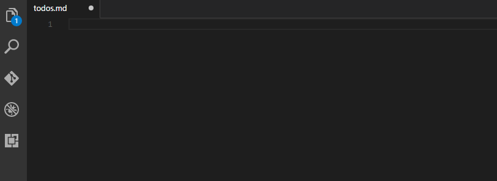

Markdown Checkbox
=

## How to use

## Keybindings
_only for markdown!_
### Create a checkbox:

> Press `ctrl-shift-c`

### Mark it as done:

> Press `ctrl-shift-enter`

---

## Example
### Todolist:
* [X] do
* [X] the
* [X] todos
* [X] in the list

## Licence
MIT