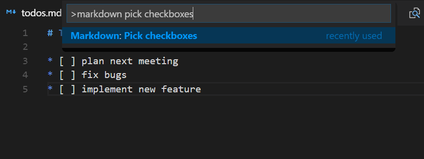

# Markdown checkbox
[](https://marketplace.visualstudio.com/items?itemName=PKief.markdown-checkbox)
[](https://marketplace.visualstudio.com/items?itemName=PKief.markdown-checkbox)
[](https://marketplace.visualstudio.com/items?itemName=PKief.markdown-checkbox)
[](https://travis-ci.com/PKief/vscode-markdown-checkbox)
[](https://ci.appveyor.com/project/PKief/vscode-markdown-checkbox)
  
## Description
With this extension for Visual Studio Code it's possible to create your todo list in markdown. The extension provides shortcuts and some workspace configurations so you can create a checkbox and mark it quickly and smoothly.

## How to use


## Information in status bar


*You have to create at least one checkbox to see this information.*

## Pick Checkboxes
Toggle all checkboxes in the current document with the Multi-Select QuickPick:



The QuickPick can be opened either from the command palette or by clicking on the status bar item.

## Keybindings
Create a checkbox:

> `ctrl`+`shift`+`c` or `⌘⇧c` (Mac)

Toggle checkbox:

> `ctrl`+`shift`+`enter` or `⇧Enter` (Mac)


## Configuration
You can customize this extension with the following options.

> *File -> Preferences -> Workspace Settings*


### Need a bullet point?
Do you need a bullet point before the created checkbox? Select true (*default*) for this:

    options: true | false

```json
"markdown-checkbox.withBulletPoint": true
```
Example:
```
* [ ] todo
```

### Type of bullet points
Select a type of bullet point:

    options: "*" | "-" | "+"
  
```json
"markdown-checkbox.typeOfBulletPoint": "*"
```

Example
```
* [ ] asterisk
- [ ] minus
+ [ ] plus
```

### Type of checkmark
Select a type of checkmark:

    options: "X" | "x"
  
```json
"markdown-checkbox.checkmark": "X"
```

Example
```
- [X] uppercase checkmark
- [x] lowercase checkmark
```

### Italic
Italic font style of line of the checkbox after the checkbox has been checked:

    options: true | false
  
```json
"markdown-checkbox.italicWhenChecked": true
```
Preview
* [X] *this line is italic*

### Strikethrough
Strikethrough the line of the checkbox after the checkbox has been checked:

    options: true | false
  
```json
"markdown-checkbox.strikeThroughWhenChecked": true
```
Preview:
* [X] ~~*this line has been crossed out*~~

### Date when checked
Add date behind the checkbox item after the checkbox has been checked:

    options: true | false
  
```json
"markdown-checkbox.dateWhenChecked": true
```
Preview:
* [X] ~~*sample with date*~~ [2017-11-23]

### Format date
If dates are enabled for the checkboxes, you can format the dates with the following user setting:

```json
"markdown-checkbox.dateFormat": "YYYY-MM-DD"
```

It makes use of the JavaScript library [moment.js](https://momentjs.com/docs/#/parsing/string-format/) which means that you can find the date format patterns on its documentation.

### Specify language IDs
Besides markdown, this extension can also be used for other languages in VS Code. You can specify the language IDs in the user settings like this:

```json
"markdown-checkbox.languages": [
    "markdown",
    "plaintext"
]
```